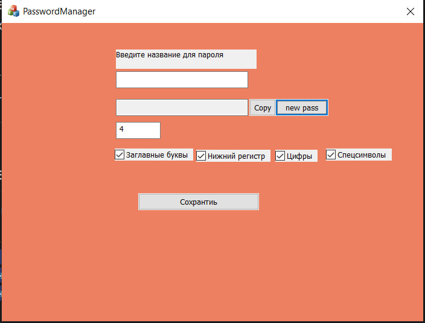

# Менеджер паролей

Это проект менеджера паролей с функцией генерации паролей. В текущей версии реализован генератор паролей с возможностью сохранить сгенерированный пароль. Пользователь может выбирать, какие символы будут использованы при генерации (буквы, цифры, специальные символы), или отключать их.

## Как выглядит?



## Установка

1. Склонируйте репозиторий:
   ```bash
   git clone https://github.com/username/password-manager.git
   cd password-manager
